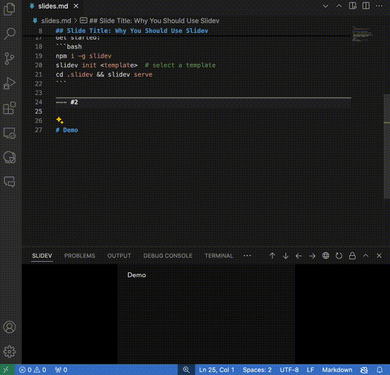

# Slidaiv

Slidaiv leverages AI/LLM to automatically generate content for Slidev presentations, making it easier for users to write a Slidev presentation.

[](./resources/slidaiv-demo.gif)

## Features

- **Automatic Content Generation**: Generate Slidev content using AI/LLM based on user prompts.
- **Easy Integration**: Seamlessly integrates with VS Code for a smooth workflow.
- **Customizable**: Users can specify their own prompts to guide the content generation process.

## Extension Settings

This extension contributes the following settings:

* `slidevContentGenerator.apiKey`: The API key for accessing the AI/LLM service.
* `slidevContentGenerator.baseUrl`: The base URL for the AI/LLM service.
* `slidevContentGenerator.model`: The model used for generating content.

## Usage

```md
...
---
# Write prompt to LLM in frontmatter and generate Slidev contents from LLM
# by **Context Menu > Generate Slidev contents** and wait a minute...)
slidaiv:
  prompt:
    - Generate awesome page to introduce Slidev
    - features, how to start it
---

<!-- Generated contents from here -->
## Slide Title: Why You Should Use Slidev

Slidev is a versatile slideshow platform that offers:

- Simple Markdown syntax, easy to learn and use!
- Highly customizable themes, UNOCSS support for styling
- Interactive features for audience engagement
- Export to HTML, PDF, or reveal.js

Get started:
` ``bash
npm i -g slidev
slidev init <template>  # select a template
cd .slidev && slidev serve
` ``

<!-- End -->

# Wrap up
...
```